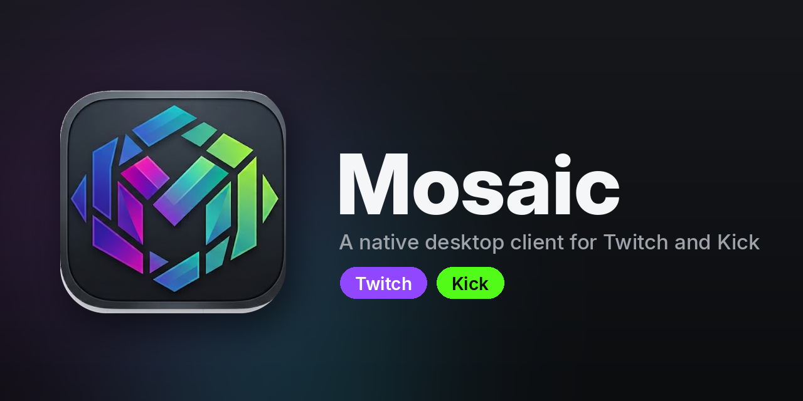

<p align="center">
  
</p>

A lightweight native desktop client for watching **Twitch and Kick** streams
and VODs, built with [Tauri](https://tauri.app) (Rust) + vanilla JS. It gives
you the whole viewing experience, full chat, multi-stream viewing,
Picture-in-Picture, live seeking, VODs, at a fraction of a browser tab's
memory, with no ads SDK and no browser chrome.

> **Status:** independent hobby project, not affiliated with or endorsed by
> Twitch Interactive, Inc. or Kick.

## Why this exists

Watching Twitch in a browser tab typically costs 1.5-2.5GB of RAM once you
account for the browser's renderer process, the full web-app bundle, ads
infrastructure, and chat rendering. Mosaic instead:

1. Uses [streamlink](https://streamlink.github.io/) as a subprocess to pull the
   raw stream (ad-stripped via `--twitch-disable-ads`),
2. Plays it natively, see [How playback works](#how-playback-works) for the
   per-platform details,
3. Renders chat and UI natively, with no browser chrome or ads SDK.

Typical memory usage lands around 30MB on Windows.

## Features

### Watching

- **Twitch and Kick in one app.** A toggle in the header switches the entire app between the two platforms, so the home feed,
  browse, search, sidebar, and the watch box all follow (Twitch is the default; Kick mode turns the accent green).
- **Ad-stripped playback** on Twitch via streamlink, with the stream played
  through a native pipeline rather than the web player.
- **Quality selection with adaptive auto mode**, steps quality down on
  sustained buffering and back up when the network recovers.
- **Low-latency mode** for Twitch live.
- **Live-DVR seeking.** Seek backward on a live stream: within a rolling buffer
  instantly, and further back against the in-progress recording if the
  broadcaster has VODs enabled.
- **VODs** with a full seek bar, chapter markers, hover seek-preview
  thumbnails, copyright-muted-segment markers, and resume-where-you-left-off.
- **VOD chat replay**, Twitch VOD comments replayed in sync with playback.
- **MultiView**, watch several streams at once in a grid, with drag-to-reorder,
  per-tile or single-focus audio, spotlight and split layouts, and per-tile
  pop-out to Picture-in-Picture.
- **Picture-in-Picture**, a floating always-on-top mini player (with fallbacks
  to Document PiP and the browser's native PiP), optional auto-PiP when you tab
  away, and a rescue control for a PiP window stranded on a disconnected monitor.
- **Twitch → Kick failover.** If a Twitch stream ends mid-watch and the streamer
  is simulcasting on Kick, playback hands over to the Kick stream automatically.
  Channel-name mismatches are handled with per-channel Kick aliases.
- **Theater mode, header/chat collapse, fullscreen, and keyboard shortcuts**
  (theater, mute, play/pause, seek). The window opens maximized.
- **Session restore**, an app reload/restart resumes what you were watching.

### Chat

- **Full Twitch chat** with send, replies, and a message history.
- **Emotes from every source**, Twitch (global + channel), 7TV, BTTV, and FFZ,
  including animated and **zero-width overlay** emotes, plus cheermotes.
- **Badges** (global and per-channel), with automatic contrast-lightening so
  hard-to-read name colors stay legible on the dark background.
- **Moderation**, delete, timeout, and ban from a user card or slash commands,
  shown only when you're a mod/broadcaster of the channel.
- **AutoMod hold queue**, review, allow, or deny held messages inline.
- **User cards**, avatar, account age, this session's message log, and mod
  actions, opened by clicking a username.
- **Link previews** on hover, **@mention autocomplete**, an **emote picker**,
  and first-time-chatter / mention highlighting.
- **Kick chat**, read live Kick chat (with Kick's native emotes and badges);
  sending requires an optional Kick login (see [Kick support](#kick-support)).

### Discovery

- **Home feed**, a carousel plus recommended and per-category rows.
- **Browse / directory**, category pills, a Categories/Live switcher, search,
  and sort.
- **Followed channels sidebar**, live and offline, plus a public Live Channels
  rail that needs no login.
- **Go-live notifications**, opt in per channel and get a system notification
  when they start streaming.
- **Raid auto-follow**, when a channel you're watching raids out, playback
  follows the raid.

### Quality of life

- **In-app auto-update** on Windows, an "Update available" banner on launch,
  one click to download and install.
- **Dependency bootstrap**, an in-app banner can install streamlink/ffmpeg for
  you on Windows.
- **System tray**, a **Drops-enabled banner** (with a link out, since relay
  playback doesn't accrue Drops, see [Known limitations](#known-limitations)),
  and a WebView2 sleep/wake surface-recovery fix.

## Download and install

The easiest way to get the app is a prebuilt installer from the
[Releases](../../releases) page, no build tools required.

- **Windows:** download the `_x64-setup.exe` from the latest release and run it.
  It's a standard per-user installer (no admin prompt). After the first install,
  the app **updates itself**: when a new release is published, an "Update
  available" banner appears on launch, and one click downloads and installs it
  without leaving the app.
- **macOS:** download the `.dmg` (Apple Silicon = `aarch64`, older Intel Macs =
  `x86_64`) from the latest release. Because the build is unsigned, the first
  launch needs **right-click → Open** once (or System Settings → Privacy &
  Security → "Open Anyway"); after that it opens normally.

Either way, you also need streamlink and ffmpeg installed (see
[Runtime requirements](#runtime-requirements)).

### Runtime requirements

The app shells out to two tools to play video. Install both before use:

- **Windows:** the app can bootstrap these for you via the in-app dependency
  banner, or install them manually.
- **macOS:** `brew install streamlink ffmpeg`
- **Linux:** install `streamlink` and `ffmpeg` from your distro's package
  manager. (See the platform-support note under [Known limitations](#known-limitations)
  - Linux is untested.)

On macOS, a Finder-launched app doesn't inherit your shell's `PATH`, so the app
looks for streamlink/ffmpeg in the usual Homebrew locations (`/opt/homebrew/bin`,
`/usr/local/bin`) automatically.

## How playback works

Playback takes a different path per platform, for good reasons:

- **Windows** pulls the stream with streamlink, relays the raw bytes over a local
  HTTP server, and feeds them to a `<video>` element via the
  [Media Source Extensions](https://developer.mozilla.org/en-US/docs/Web/API/Media_Source_Extensions_API)
  API. This keeps streamlink in the loop to actively strip mid-stream ads.
- **macOS** resolves an ad-free HLS playlist URL with streamlink, routes it
  through a local CORS proxy, and lets WebKit play it as **native HLS**. This is
  because WebKit's Media Source Extensions implementation is unreliable for this
  use case, whereas native HLS is hardware-accelerated and robust. (A tradeoff:
  streamlink isn't kept in-loop to splice dynamically-stitched mid-stream ads on
  this path, so some may occasionally leak where the Windows path would catch
  them.)
- **VODs** on all platforms, and **Kick** on Windows, play through hls.js /
  native HLS. (Kick on macOS is untested, see the platform note below.)

## Known limitations

- **Twitch Drops and Channel Points do not accrue while watching through this
  app.** Both are tracked by a "minute watched" heartbeat that only the official
  Twitch player emits. This app plays real video from a real stream, but that
  specific signal isn't part of what streamlink relays, so Twitch's backend has
  no way to know you're watching. If a drop matters to you, watch that stream in
  a browser or the official app instead.
- **Live seeking is limited to a rolling ~2 minute buffer** unless the streamer
  has VODs enabled, in which case seeking further back transparently switches to
  hls.js against the in-progress VOD (see the comments above
  `seekToClickPosition` in `src/playback-controls.js`). There's an unavoidable
  few-seconds delay the first time you do this per session, since it involves
  resolving a CDN URL; subsequent seeks reuse a cached URL and are much faster.
- **Platform support:** the app has had the most real-world testing on Windows,
  followed by macOS. **Linux is fully untested**. It's targeted by the build
  scripts and may build, but nothing on it has been verified. **Kick on macOS is
  also untested** and may not work. Treat both as unsupported for now.

## Building from source

You only need this if you want to develop or build the app yourself. Most people
should use a prebuilt installer from [Releases](../../releases).

### Prerequisites

- [Node.js](https://nodejs.org/) 18+
- [Rust](https://www.rust-lang.org/tools/install) (stable toolchain)
- Platform build tools: **Windows**, Microsoft C++ Build Tools + WebView2
  runtime; **macOS**, Xcode Command Line Tools; **Linux**, `webkit2gtk`,
  `libssl`, `librsvg2`, and friends.
- [streamlink](https://streamlink.github.io/install.html) and `ffmpeg`
  (runtime dependencies, see above)

The bootstrap scripts (`build-unix.sh`, `build-windows.ps1`) install all of the
above for you and then build. Run `build-windows.ps1` from an elevated
PowerShell, or `./build-unix.sh` on macOS/Linux.

### Develop

```bash
npm install
npm run tauri dev
```

This launches the app with the frontend hot-reloading.

### Build an installer

```bash
npm run tauri build
```

Add `-- --bundles nsis` to build only the Windows `.exe` installer. Output lands
under `src-tauri/target/release/bundle/` (e.g. `nsis/Mosaic_1.2.0_x64-setup.exe`,
`dmg/Mosaic_1.2.0_aarch64.dmg`).

> **Note:** `createUpdaterArtifacts` is enabled, so `tauri build` requires the
> updater signing key. For a plain local build without signing, use
> `npm run tauri dev`, or set the `TAURI_SIGNING_PRIVATE_KEY` /
> `TAURI_SIGNING_PRIVATE_KEY_PASSWORD` environment variables. See
> [UPDATER_SETUP.md](./UPDATER_SETUP.md).

### Releases and auto-updates (maintainers)

Releases are built and published by GitHub Actions:

- Pushing a `v*` tag (or publishing a release with that tag) triggers the Windows
  workflow, which builds and signs the installer and attaches it, plus the
  `latest.json` the auto-updater checks, to the release.
- The macOS workflow is manual (run it from the Actions tab when a macOS build is
  needed).

The Windows auto-updater requires a signing keypair; setup is documented in
[UPDATER_SETUP.md](./UPDATER_SETUP.md). The app checks the latest release's
`latest.json` on startup and offers the update in-app.

### Logging in

Login uses Twitch's standard OAuth implicit-grant flow via your system's default
browser (not an embedded webview, see the comment block at the top of
`src-tauri/src/oauth.rs` for why). No client secret is involved; the `CLIENT_ID`
values in this repo are public identifiers, not credentials, and are safe to keep
in source control. If you fork this project for real-world use, you may want to
[register your own Twitch application](https://dev.twitch.tv/console/apps) and
swap in your own client ID.

## Project structure

```
src/                    Frontend (vanilla JS, no framework)
  main.js               App entry point / state orchestration
  session.js            Shared "what's playing" state
  platform.js           Twitch/Kick mode + command routing
  stream-player.js      MSE feeder for the live relay (Windows path)
  vod-player.js         hls.js / native-HLS wrapper (VODs, Kick, macOS live)
  playback-controls.js  Seek bar, quality menu, live-DVR handoff, PiP
  pip.js                Native always-on-top PiP window controller
  multiview.js          Multi-stream grid
  channel-info-bar.js   Below-player info strip + in-video overlay
  layout.js             Page switching, theater/fullscreen, chrome
  chat.js               Chat connection lifecycle + message pipeline
  chat/                 Chat feature mixins (see file header comments):
                          chat-emotes.js, emote-parsing.js, chat-badges.js,
                          kick-badges.js, chat-events.js, chat-automod.js,
                          chat-usercard.js, chat-mod-actions.js,
                          chat-link-preview.js, chat-autocomplete.js,
                          chat-emote-picker.js, chat-vod-replay.js, shared.js
  home.js, browse.js, vods.js, sidebar.js   Discovery UI
  auth.js               Twitch login (frontend)
  kick-aliases.js       Twitch->Kick failover aliases
  kick-follows.js       Local Kick follow list
  chapters.js           Twitch VOD chapter markers
  seek-thumbnails.js    VOD storyboard seek-preview thumbnails
  session-restore.js    Resume the last session across a reload
  drops.js, drops-banner.js         Drops-enabled detection + banner
  deps-banner.js        streamlink/ffmpeg bootstrap banner
  update-banner.js      In-app auto-updater UI (Windows)
  format.js             Small display-formatting helpers

src-tauri/src/          Backend (Rust)
  main.rs               Tauri app setup and command registration
  helix.rs              Twitch Helix (REST API) commands
  stream_relay.rs       Spawns streamlink/ffmpeg, relays bytes over HTTP
                          (Windows), resolves ad-free m3u8 URLs (macOS),
                          and proxies HLS for CORS
  chat.rs               Twitch IRC WebSocket connection
  chat_commands.rs      Chat-backed commands (send, mod actions, chatters)
  oauth.rs              Native-browser OAuth flow (Twitch)
  eventsub.rs           Twitch EventSub (go-live notifications, raids, AutoMod)
  seventv_events.rs     7TV real-time emote updates
  link_preview.rs       Chat link hover-preview metadata fetching
  vod_progress.rs       Persisted VOD watch progress (resume)
  notify_prefs.rs       Persisted per-channel notification preferences
  deps_check.rs         streamlink/ffmpeg detection and install
  tray.rs               System tray icon/menu
  kick.rs               Kick API (streams, categories, VODs) as Helix shapes
  kick_chat.rs          Kick chat (Pusher) client
  kick_oauth.rs         Kick OAuth 2.1 + PKCE flow
```

## Contributing

See [CONTRIBUTING.md](./CONTRIBUTING.md).

## License

[MIT](./LICENSE), see that file for the full text. Twitch, the Twitch logo, and
related marks are trademarks of Twitch Interactive, Inc.; Kick and related marks
are trademarks of their respective owners. This project is an independent,
unofficial client.

## Kick support

The platform toggle in the header (right of **Browse**) switches the whole app
between Twitch and Kick: home feed, browse/categories/search, the sidebar's live
channels, and the watch box. Twitch is the default (purple border); Kick mode
turns the border green.

> **Platform note:** Kick support is developed and tested on Windows. On macOS it
> is currently **untested and may not work**. The macOS playback path differs
> from Windows (native HLS vs the byte relay), and Kick on that path hasn't been
> verified. Treat macOS Kick as unsupported for now.

### Kick login (optional, needed only to type in Kick chat)

Watching Kick streams and reading Kick chat need no login. **Sending** chat
messages does. Kick uses OAuth 2.1 with PKCE and, unlike Twitch's implicit flow,
requires a client secret even for desktop apps.

To enable it:

1. Register an app at <https://kick.com/settings/developer>.
2. Set its redirect URI to exactly `http://localhost:17544/`.
3. Request the `user:read` and `chat:write` scopes.
4. Provide the credentials to the build, either by editing the defaults in
   `src-tauri/src/kick_oauth.rs` (`CLIENT_ID` / `CLIENT_SECRET`) or by setting
   `KICK_CLIENT_ID` / `KICK_CLIENT_SECRET` as build-time environment variables,
   which override the defaults.
5. Rebuild.

Until this is done, `kick_oauth_configured()` returns false and the app simply
hides the "Log in with Kick" button, so Kick chat stays read-only rather than
offering a login that could only fail. Tokens are stored in
`kick_oauth_token.json` in the app's local data dir, separate from the Twitch
token, and are refreshed automatically when they expire (~1 hour).

> **Note on the Kick client secret:** Kick requires it even for desktop apps, but
> a secret shipped inside a distributed binary can't truly stay secret. Treat it
> as a semi-public app identifier; if it's ever abused, rotate it in the Kick
> developer console. To keep it out of a public repo entirely, supply it via the
> `KICK_CLIENT_SECRET` build-time env var instead of hardcoding it.
